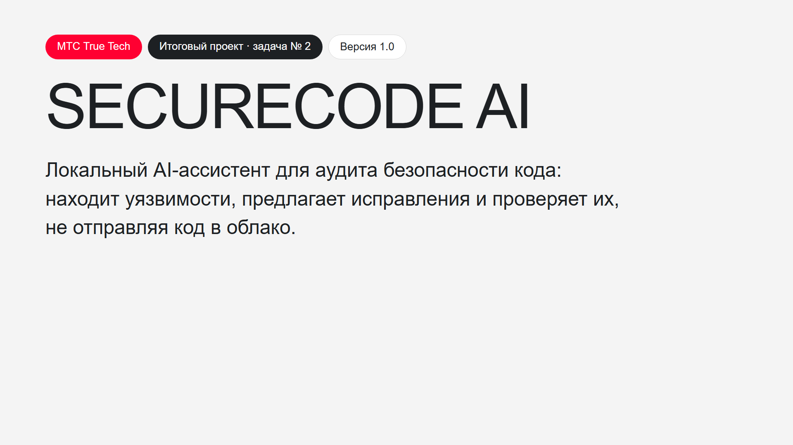

# SecureCode AI

**Русский** | [English](README.en.md)

[Видео](#видео) · [Итоговый отчёт](https://mydev.stream/final-submission.html) · [Эксперименты](https://mydev.stream/benchmark.html) · [Notebook](notebooks/securecode_demo.ipynb) · [Сайт проекта](https://mydev.stream/) · [Релизы](https://github.com/shorinversion/securecode-ai/releases)

SecureCode AI — локальный AI-ассистент для аудита безопасности кода на Python,
JavaScript, TypeScript и Go. Детерминированные инструменты (AST, секреты, уязвимые
зависимости, CWE-сканеры) и квантованная LLM в ролях **Аудитора**, **Скептика** и **Архитектора**
находят уязвимости, предлагают исправления в виде diff и проверяют их во временной
копии; результат — отчёт с классификацией OWASP Top 10.

> **Статус: 1.0.** Демо Аудитор → Архитектор завершается `COMPLETED` и на локальной
> Qwen 2.5 Coder 7B Q4_K_M, и на DeepSeek: CWE-89 найден, patch проверен. На 600 кейсах
> CVEfixes комбинация сканеров и LLM на уровне Semgrep по recall, но не лучше.
> Production readiness не заявляется. Соответствие заданию по пунктам — в
> [итоговом отчёте](https://mydev.stream/final-submission.html#соответствие-заданию).

## Видео

[](https://mydev.stream/securecode-demo.mp4)

Демонстрация на русском, 2:47: задача, архитектура с Аудитором, Скептиком и Архитектором,
живой прогон на локальной Qwen, отчёт с OWASP Top 10, инструменты и эксперименты.
Нажмите на картинку, чтобы открыть видео.
[English version](https://mydev.stream/securecode-demo.en.mp4).

## Быстрый старт

```bash
python deploy/docker/quickstart.py --demo
```

Нужен только Docker. Команда собирает образ, проверяет демонстрационный уязвимый
код и печатает отчёт: находка, CWE, категория OWASP Top 10, строка и, при наличии
модели, проверенный Auto-Fix patch. Если в окружении или в корневом `.env` задан
`DEEPSEEK_API_KEY`, Аудитор и Архитектор работают на DeepSeek; без ключа работает
только детерминированный lane (итог `INDETERMINATE`).

```bash
python deploy/docker/quickstart.py --demo --provider local
```

Тот же сценарий на локальной квантованной Qwen: нужны [uv](https://docs.astral.sh/uv/)
и запущенный [Ollama](https://ollama.com); модель `qwen2.5-coder:7b-instruct-q4_K_M`
(около 4.7 ГБ) скачается автоматически. Отчёты: `output/demo-report/`.

Полный прогон инструментов (AST, секреты, уязвимые зависимости, CWE-сканеры, единый
контракт, агенты, отчёт, метрики) с сохранёнными выводами:
[notebooks/securecode_demo.ipynb](notebooks/securecode_demo.ipynb).

## Назначение

SecureCode AI проверяет точную Git-ревизию, объединяет детерминированный поиск и
независимое исследование локальной LLM, нормализует кандидаты в единый граф
доказательств и публикует результат только после обязательной интерпретации и
проверок. Исправления создаются как отдельные артефакты, проверяются во временной
среде и не применяются к исходному checkout без явного одобрения.

Основные поверхности продукта:

- автономная CLI для локального аудита, подготовки исправлений и валидации;
- Linux worker для выполнения точного задания в CI;
- ASGI control plane с очередью, состоянием запусков, approvals и audit trail;
- адаптеры GitHub и GitLab для exact-SHA статусов и ограниченной публикации;
- воспроизводимые учебные эксперименты, notebook и отчеты.

## Архитектура

```text
Git checkout at an exact commit
             |
             v
  deterministic discovery  +  model-native discovery
             \                    /
              v                  v
           normalized candidates
                     |
                     v
          Auditor and Skeptic checks
                     |
                     v
      EvidenceGraph + policy decision + reports
                     |
          +----------+-----------+
          |                      |
          v                      v
   local CLI / worker      control plane / SCM
```

Два графа решают разные задачи:

- `WorkflowGraph` управляет переходами, бюджетами, retry, approval и stop
  conditions;
- `EvidenceGraph` связывает finding, source location, tool/model observations,
  patch, validation и provenance.

Доменная логика находится в `packages/core/` и не зависит от транспорта или
конкретного graph runtime. `packages/contracts/` владеет закрытыми Pydantic
контрактами и JSON Schema. `packages/adapters/` реализует Git, CST, model,
sandbox и SCM границы. CLI, server и worker только собирают эти общие части.

Подробности: [архитектура](docs/ARCHITECTURE.md),
[продуктовая модель](docs/PRODUCT.md) и
[модель угроз](docs/security/THREAT_MODEL.md).

## Языки и CWE

| Область | Поддержка в текущем коде | Ограничение |
| --- | --- | --- |
| Python | `.py`, `.pyi`; AST и CST, таблица символов, CWE-89 и около 30 других CWE-сканеров | Покрытие зависит от поддерживаемых source/sink patterns |
| JavaScript / TypeScript | `.js`, `.mjs`, `.cjs`, `.jsx`, `.ts`, `.tsx`; CST, таблица символов, CWE-89 и около 30 других CWE | Типы TypeScript не превращают анализ в полный compiler pass |
| Go | `.go`; CST, таблица символов, CWE-89 и около 30 других CWE | Ограниченный набор проверенных patterns |
| Все файлы | захардкоженные секреты; манифесты pip, npm и Go с проверкой по OSV | Значения секретов не сохраняются |

Среди сканеров: инъекции (CWE-78, 79, 89, 90, 94), обход путей (22), SSRF (918),
отсутствие авторизации и аутентификации (862, 306), небезопасная десериализация
(502), слабая криптография и случайность (327, 338), захардкоженные учётные данные
(798), ReDoS (1333) и другие. Каждый CWE отображается на категорию OWASP Top 10 2021.

Это описание реализованных правил, а не обещание полного покрытия CWE и не
утверждение о превосходстве над SAST. Текущие результаты расширенного сравнения
на 600 кейсах приведены в [submission benchmark](report/submission-benchmark/README.md).
Ранний development benchmark и его ограничения сохранены отдельно:
[протокол и результаты](report/development-benchmark/README.md),
[ограничения](report/development-benchmark/limitations.md).

## Проверка кандидата

Команда `uv run --locked python -I scripts/quality.py` запускает Ruff format и
lint, mypy для Linux и Windows и pytest (unit-тесты и интеграционные тесты демо) с
порогом покрытия ядра 80%. На текущем `main` результат `QUALITY=PASS`, 3292 теста;
CI повторяет те же проверки на Python 3.12, 3.13 и 3.14, а также проверяет секреты
и зависимости.

## Требования и установка

- Git;
- CPython `>=3.12,<3.15`;
- [uv](https://docs.astral.sh/uv/) строго версии `0.12.0`;
- Docker только для образов server/worker, изолированной repair validation и
  opt-in corpus oracle;
- Ollama только для локального model path.

Из чистого clone:

```powershell
git clone <repository-url> securecode-ai
Set-Location securecode-ai
uv --version
uv sync --locked --no-dev --no-editable
uv run --locked --offline --no-sync securecode --version
```

`uv.lock` является единственным источником разрешенных Python-зависимостей.
`--locked` запрещает незаметное обновление lock, а `--no-editable` проверяет
установочный путь без импорта прямо из исходного дерева. Для разработки:

```powershell
uv sync --locked --no-editable --group quality
```

## Быстрый старт без модели

Воспроизводимая публичная демонстрация не читает приватный код, не вызывает LLM
и работает во временном workspace:

```powershell
$output = Join-Path $PWD '.securecode/demo-cwe89'
New-Item -ItemType Directory -Path $output | Out-Null
uv run --locked --offline --no-sync python -I demo/mvp_cwe89_demo.py --output $output
```

Ожидаемый узкий сценарий: vulnerable Python fixture дает один CWE-89 signal,
safe control дает ноль, reference repair предлагается и проверяется только в
эфемерной копии, исходный checkout остается неизменным.

Базовая диагностика установленной CLI:

```powershell
uv run --locked --offline --no-sync securecode doctor
uv run --locked --offline --no-sync securecode scan . --diagnostic --format json
```

Полный `securecode scan` требует защищенный host approval record и точное
совпадение одобренных profile, policy, provider evidence и исполняемого Git.
Отсутствующая или измененная authority приводит к безопасному отказу.

## Локальный Ollama

Записанный учебный путь использует только literal loopback и точные значения:

| Параметр | Значение |
| --- | --- |
| Endpoint | `http://127.0.0.1:11434/v1` |
| Ollama | `0.34.4` |
| Model | `qwen2.5-coder:7b-instruct-q4_K_M` |
| Quantization | `Q4_K_M` |
| Expected model digest | `dae161e27b0e90dd1856c8bb3209201fd6736d8eb66298e75ed87571486f4364` |

Чтобы повторить текущую real-local демонстрацию, запустите Ollama локально и
загрузите модель. Команда не обращается к облачному провайдеру:

```bash
uv run --locked python -I demo/p917_real_local_demo.py --repository demo/fixtures/real-local-cwe89 --output output/demo-report
```

Отчёт: `output/demo-report/security-report.md` (и `.html`); фикстура читается из
неизменяемого снимка и не изменяется.

Текущая обезличенная квитанция находится в
[`report/submission-benchmark/evidence/current-real-local-p917.json`](report/submission-benchmark/evidence/current-real-local-p917.json).
Прогон 29 сентября 2026: Qwen нашла CWE-89, совпавший с детерминированным
сканером, и предложила параметризованный запрос; patch распарсился, повторный
скан дал 0 сигналов, `outcome=COMPLETED`, исходный checkout не изменён.

Тот же сценарий на DeepSeek (профиль `deepseek-owner-authorized`, согласие
владельца в [`deploy/deepseek/owner-consent.json`](deploy/deepseek/owner-consent.json)):
ключ берётся из `DEEPSEEK_API_KEY` или из строки `DEEPSEEK_API_KEY=...` в
корневом `.env` (файл игнорируется Git), расход ограничен $0.10 на прогон.

```bash
uv run --locked python -I demo/p917_real_local_demo.py --repository demo/fixtures/real-local-cwe89 --output output/demo-report --provider deepseek
```

Квитанция: [`current-deepseek-p917.json`](report/submission-benchmark/evidence/current-deepseek-p917.json)
(`outcome=COMPLETED`, 2 вызова, $0.00014). Условия хранения и обучения у
DeepSeek не проверены; отправляйте только код, который вы вправе раскрыть.

Пример локальной подготовки:

```powershell
$env:OLLAMA_HOST = '127.0.0.1:11434'
ollama serve
```

В другом терминале:

```powershell
ollama pull qwen2.5-coder:7b-instruct-q4_K_M
ollama list
uv run --locked --offline --no-sync python -I demo/p917_real_local_demo.py --help
```

Перед отправкой source gateway проверяет bounded `/api/version` и `/api/tags`,
точные model name и digest, а после generation повторяет проверку. Endpoint,
model и API key нельзя переопределить произвольными `SECURECODE_LLM_*`
переменными. Продукт выбирает только заранее одобренные значения:

```powershell
$env:SECURECODE_PROVIDER_PROFILE = 'local-source-model@1.0.0'
$env:SECURECODE_POLICY_PROFILE = 'private-model-source'
$env:SECURECODE_EGRESS_PROFILE = 'private_model_zdr'
```

Эти selectors не создают approval record и не допускают provider сами по себе.
Installed product path дополнительно требует защищенную OS authority: HKLM на
Windows или root-owned files на Linux. Публичная команда автоматического
provisioning этой authority в репозитории отсутствует.

## Онлайн DeepSeek для benchmark

Проверенный онлайн-провайдер в эксперименте: DeepSeek V4.1 Flash (`deepseek-flash`), temperature `0`, JSON mode, reasoning отключен. Benchmark отправляет исходники только из публичного CVEfixes корпуса. Не подключайте этот маршрут к приватному репозиторию: он делает прямые классификационные запросы к API и не является полным SecureCode product pipeline.

В PowerShell задайте ключ только в текущем процессе. Не сохраняйте его в Git, README, notebook или отчет:

```powershell
$secureKey = Read-Host 'DeepSeek API key' -AsSecureString
$env:DEEPSEEK_API_KEY = [System.Net.NetworkCredential]::new('', $secureKey).Password
$env:DEEPSEEK_BASE_URL = 'https://api.deepseek.com'
$env:DEEPSEEK_MODEL = 'deepseek-flash'
```

Короткий запуск требует локальную CVEfixes SQLite v1.0.8 базу и явный spend guard. Укажите свой путь в `$database`; пример обрабатывает пять публичных кейсов:

```powershell
$database = 'C:\data\CVEfixes_v1.0.8.sqlite'
$candidate = (git rev-parse HEAD).Trim()
$profile = (Get-FileHash report/submission-benchmark/evidence/model-profile.json -Algorithm SHA256).Hash.ToLowerInvariant()
New-Item -ItemType Directory -Force output | Out-Null
try {
  uv run --locked --offline --no-sync --group quality python -m scripts.run_release_benchmark `
  --manifest report/submission-benchmark/evidence/cvefixes-manifest.json `
  --database $database --configuration model_native `
  --output output/deepseek-smoke.json --limit 5 --repetitions 1 `
  --allow-public-remote --spend-ledger output/deepseek-smoke-spend.sqlite `
  --budget-phase development --total-budget-microusd 10000000 `
  --candidate-sha $candidate --profile-sha256 $profile `
  --max-input-tokens 1000000 --max-output-tokens 64 `
  --input-microusd-per-million 150000 --output-microusd-per-million 600000
} finally {
  Remove-Item Env:DEEPSEEK_API_KEY -ErrorAction SilentlyContinue
  $secureKey.Dispose()
}
```

Для сохраненных результатов без новых API вызовов запустите агрегатор из [benchmark report](report/submission-benchmark/README.md). Подключение DeepSeek в product worker требует отдельно принятых provider/egress профилей, лимитов расходов и защищенного host approval. Одних переменных API недостаточно, а end-to-end benchmark продукта через DeepSeek пока не выполнен.

## CLI

```text
securecode doctor
securecode scan TARGET [--config FILE] [--format json|sarif|markdown|html] [--output FILE]
securecode scan TARGET --diagnostic [--format json|sarif|markdown|html] [--output FILE]
securecode fix TARGET [--format json|sarif|markdown|html|diff] [--output FILE]
securecode validate TARGET --patch SELECTOR [--format json|sarif|markdown|html|diff]
securecode approve TARGET --patch SELECTOR --artifact-sha256 SHA256 \
  --capability SHA256 --approval-id ID --approver-id ID [--output FILE]
securecode release --config FILE
securecode release --config FILE --publish --authorization FILE
```

Примеры:

```powershell
securecode scan C:\src\project --format sarif --output C:\reports\securecode.sarif
securecode fix C:\src\project --format json --output C:\reports\repair.json
securecode validate C:\src\project --patch <retained-selector> --format json
securecode release --config C:\release\candidate.json
```

`release` выполняет dry run по умолчанию. Публикация требует отдельно
защищенный config, authority key и короткоживущую authorization, привязанную к
точному candidate digest. Команда создает immutable локальный release store, а
не GitHub Release.

| Код | Значение |
| ---: | --- |
| `0` | операция завершена |
| `2` | policy fail |
| `3` | indeterminate |
| `4` | operational error |
| `5` | invalid usage or configuration |
| `6` | cancelled or superseded |

## Docker: server и worker

Сборка трех локальных образов из корня репозитория:

```powershell
pwsh -NoProfile -File deploy/docker/build-images.ps1
```

Скрипт создает `securecode-ai/runtime:1.0.1`,
`securecode-ai/server:1.0.1` и `securecode-ai/worker:1.0.1`, затем печатает их
immutable image IDs. Linux `amd64` используется по умолчанию; `linux/arm64`
можно передать через `-Platform`.

Server запускается непривилегированным UID `65532`, пишет только в
`/var/lib/securecode` и `/tmp/securecode`, требует TLS при bind на `0.0.0.0` и
при первом запуске требует OIDC либо bootstrap identities:

```bash
docker network create securecode
docker volume create securecode-data
docker run --rm --name securecode-server --network securecode -p 8443:8080 \
  --mount type=volume,src=securecode-data,dst=/var/lib/securecode \
  --mount type=bind,src=/absolute/securecode-secrets,dst=/run/secrets,readonly \
  -e SECURECODE_BOOTSTRAP_TENANT_ID=tenant-1 \
  -e SECURECODE_BOOTSTRAP_ADMIN_TOKEN_FILE=/run/secrets/admin_token \
  -e SECURECODE_BOOTSTRAP_WORKER_TOKEN_FILE=/run/secrets/worker_token \
  -e SECURECODE_BOOTSTRAP_WORKER_REPOSITORIES=repository-1 \
  securecode-ai/server:1.0.1
```

Каталог secrets должен содержать доступные UID `65532` файлы
`securecode_tls_cert`, `securecode_tls_key`, `admin_token` и `worker_token`.
Приватный TLS key должен быть обычным файлом без group/other permissions, а
сертификат должен быть доверенным worker-образом. Каждый token содержит не
менее 32 символов.

Worker подключается к control plane и исполняет общий Core в local checkout:

```bash
docker run --rm --name securecode-worker --network securecode \
  --mount type=bind,src=/absolute/source-checkout,dst=/workspace,readonly \
  --mount type=bind,src=/absolute/securecode-secrets,dst=/run/secrets,readonly \
  -e SECURECODE_CONTROL_PLANE_URL=https://securecode-server:8080 \
  -e SECURECODE_WORKER_TOKEN_FILE=/run/secrets/worker_token \
  -e SECURECODE_WORKER_ID=worker-1 \
  -e SECURECODE_WORKER_TARGET=/workspace \
  securecode-ai/worker:1.0.1
```

Можно ограничить один запуск через `SECURECODE_WORKER_RUN_ID`. Для GitLab
worker получает `CI_PROJECT_ID`, `CI_MERGE_REQUEST_IID` и точный
`CI_COMMIT_SHA`. Разрешенные artifact hosts задаются через
`SECURECODE_WORKER_ARTIFACT_HOSTS`. Дополнительная Compose-конфигурация и
ограничения запуска описаны в [deploy/docker/README.md](deploy/docker/README.md).
Kubernetes manifests в текущем дереве отсутствуют.

## GitHub CI

Файл [`.github/workflows/ci.yml`](.github/workflows/ci.yml) уже содержит CI
самого проекта. Он запускается на pull request, merge queue и push в `master`:

1. проверяет CI/dependency policy и pinned Actions;
2. сканирует текущее дерево и candidate history на secrets;
3. аудирует hash-complete locked dependency graph;
4. выполняет specification/candidate gate;
5. запускает quality matrix на Python 3.12, 3.13 и 3.14;
6. объединяет обязательные результаты в `gate`.

Для fork включите GitHub Actions и настройте branch protection с required check
`gate`. Workflow использует только `contents: read`, не сохраняет checkout
credential и не объявляет repository secrets.

Для product GitHub App control plane ожидает:

- `SECURECODE_GITHUB_API_URL`;
- `SECURECODE_GITHUB_INSTALLATION_ID`;
- `SECURECODE_GITHUB_TOKEN_FILE`;
- `SECURECODE_GITHUB_WEBHOOK_SECRET_FILE`;
- `SECURECODE_SCM_PINS_FILE` и `SECURECODE_SCM_TENANT_ID`.

Webhook GitHub App направьте на
`POST /api/v1/integrations/github/webhook`. Для GitLab используйте
`POST /api/v1/integrations/gitlab/webhook` и задайте
`SECURECODE_GITLAB_API_URL`, `SECURECODE_GITLAB_TOKEN_FILE` и
`SECURECODE_GITLAB_WEBHOOK_SECRET_FILE`. В обоих случаях URL строится от
внешнего HTTPS-адреса control plane.

`SECURECODE_SCM_PINS_FILE` должен быть JSON-объектом ровно с семью ключами.
Каждый pin содержит `schema_version: "0.2.0"`, `component_id`, SemVer в `component_version` и фактический
64-символьный lowercase SHA-256 соответствующего принятого артефакта:
`schema_version` обозначает версию wire-контракта, а `component_version` версию
самого принятого компонента.

```json
{
  "stage_catalogue": {"schema_version": "0.2.0", "component_id": "stage-catalogue", "component_version": "1.0.0", "content_sha256": "1111111111111111111111111111111111111111111111111111111111111111"},
  "workflow": {"schema_version": "0.2.0", "component_id": "workflow", "component_version": "1.0.0", "content_sha256": "2222222222222222222222222222222222222222222222222222222222222222"},
  "policy": {"schema_version": "0.2.0", "component_id": "policy", "component_version": "1.0.0", "content_sha256": "3333333333333333333333333333333333333333333333333333333333333333"},
  "configuration": {"schema_version": "0.2.0", "component_id": "configuration", "component_version": "1.0.0", "content_sha256": "4444444444444444444444444444444444444444444444444444444444444444"},
  "provider_profile": {"schema_version": "0.2.0", "component_id": "provider-profile", "component_version": "1.0.0", "content_sha256": "5555555555555555555555555555555555555555555555555555555555555555"},
  "capability_profile": {"schema_version": "0.2.0", "component_id": "capability-profile", "component_version": "1.0.0", "content_sha256": "6666666666666666666666666666666666666666666666666666666666666666"},
  "egress_profile": {"schema_version": "0.2.0", "component_id": "egress-profile", "component_version": "1.0.0", "content_sha256": "7777777777777777777777777777777777777777777777777777777777777777"}
}
```

Числа в примере являются заглушками. Замените их хэшами реально принятых
bytes, сохраните файл вне checkout и смонтируйте read-only с правами `0600`.
Лишний или отсутствующий ключ, неверный SemVer либо digest блокирует запуск.

App требует только Metadata read, Pull requests read/write, Checks read/write,
Contents read и Code scanning alerts/Security events write, если используется
SARIF upload. Administration, Workflows write и merge permissions не нужны.

## GitLab CI

Корневой [`.gitlab-ci.yml`](.gitlab-ci.yml) не запускает untrusted audit в
source pipeline. Для merge request из того же проекта он инициирует защищенный
downstream project и передает только project ID, MR IID и exact commit SHA.

1. Создайте отдельный trusted audit project на защищенном runner.
2. Используйте [trusted audit pipeline](deploy/gitlab/trusted-audit.yml) как его
   CI config.
3. Замените `registry.example.invalid/...` на реальный registry path, сохранив
   проверенный image digest или повторно проведя review нового digest.
4. В source project задайте protected variables
   `SECURECODE_TRUSTED_AUDIT_PROJECT` и `SECURECODE_TRUSTED_AUDIT_REF`.
5. В trusted project задайте `SECURECODE_ALLOWED_SOURCE_PROJECT_ID`,
   `SECURECODE_CONTROL_PLANE_URL` и file-type variable
   `SECURECODE_WORKER_TOKEN_FILE`. При необходимости добавьте
   `SECURECODE_WORKER_ARTIFACT_HOSTS`.
6. В source project откройте **Settings > CI/CD > Job token permissions** и
   добавьте trusted audit project в authorized projects allowlist. Это дает его
   `CI_JOB_TOKEN` узкий доступ к API source project и MR-head ref, которые
   проверяет и получает `trusted-audit.yml`.
7. Защитите audit ref и предоставьте runner tag `securecode-ai-gpu`.

Pipeline отклоняет fork MR, неподходящий project ID, незащищенный ref и SHA,
который не совпадает с открытым MR head. Итоговый job не имеет доступа к
control-plane database или SCM write credentials.

## Модель безопасности

- Mandatory dual lane: ноль deterministic signals не пропускает model-native
  discovery.
- Любой mandatory timeout, refusal, invalid schema или недоступный provider
  дает `INDETERMINATE`, а не clean result.
- Анализ привязан к exact Git SHA; изменение HEAD отменяет публикацию.
- По умолчанию source остается в runner. Telemetry не имеет полей для raw
  source, prompts, model replies, patches, credentials и arbitrary labels.
- Private model endpoint допускается только на literal loopback после
  профильно-политической и host-authority проверки.
- Model output считается untrusted data и проходит closed-schema validation.
- Patch сначала сохраняется как отдельный digest-bound artifact, затем
  проверяется в изоляции и требует отдельного approval.
- Worker не получает control-plane database и SCM write credentials.
- Secrets не должны попадать в repository, отчеты, notebook или durable
  project memory. `.env`, keys, runtime state и local outputs исключены Git.

Полные правила: [data classification](specs/security/data-classification.md),
[prompt injection](docs/security/PROMPT_INJECTION.md) и
[threat model](docs/security/THREAT_MODEL.md).

## Статус и ограничения

- Демо Аудитор → Архитектор на фикстуре CWE-89 завершается `COMPLETED` на
  локальной Qwen 2.5 Coder 7B Q4_K_M (Ollama 0.34.4) и на DeepSeek Flash:
  находка совпадает с детерминированным сканером, patch проходит парсинг, повторный
  скан и `git apply --check`. Квитанции:
  [Qwen](report/submission-benchmark/evidence/current-real-local-p917.json),
  [DeepSeek](report/submission-benchmark/evidence/current-deepseek-p917.json).
  Демонстрация охватывает одно правило; поведенческие тесты патча не запускаются.
- Бенчмарк на 600 кейсах CVEfixes: детерминированный lane завершил 508 кейсов
  (92 непарсящихся файла учтены как незавершённые), hybrid получил 32.8% recall на
  held-out против 32.5% у Semgrep; интервал включает ноль, то есть hybrid на уровне
  SAST, но не лучше. Модельные lanes — прямые запросы к DeepSeek, а не полный
  конвейер с Аудитором и Скептиком; repair на корпусе не оценивался. Precision всех
  конфигураций около 50%. Подробности:
  [отчёт бенчмарка](report/submission-benchmark/README.md).
- Полный `securecode scan` требует заранее подготовленной защищённой OS authority;
  общий сценарий её подготовки не опубликован, поэтому для проверки предназначены
  демо и notebook.
- Docker-образы server/worker и Compose есть; `quickstart.py --up` на Linux не
  перепроверялся, проверенного production deployment нет. Путь образа trusted worker
  для GitLab — явный placeholder.
- Production readiness не заявляется; quality receipts подтверждают
  воспроизводимость, а не отсутствие уязвимостей.

## Структура репозитория

| Путь | Содержимое |
| --- | --- |
| `apps/cli/` | команда `securecode` |
| `apps/server/` | ASGI control plane и maintenance CLI |
| `apps/worker/` | one-shot и connected Linux worker |
| `packages/contracts/` | versioned domain, event, model и runtime contracts |
| `packages/core/` | framework-independent workflow, evidence, policy, repair и evaluation logic |
| `packages/adapters/` | Git, CST, provider, sandbox, report и SCM adapters |
| `integrations/` | границы GitHub/GitLab transport integration |
| `deploy/` | Dockerfiles и GitLab trusted audit pipeline |
| `specs/` | принятые нормативные спецификации и schemas |
| `tests/` | unit, contract, integration, negative и security regression tests |
| `demo/` | публичная offline demo и real-local Ollama demo |
| `evaluation/` | development corpus, run plan и machine-readable results |
| `notebooks/` | воспроизводимые учебные notebooks |
| `report/` | academic bundle и development benchmark |
| `artifacts/gates/` | сохраненные gate evidence packets |
| `docs/` | архитектура, продукт, решения, план, research и security docs |

## Разработка и проверки

```powershell
uv run --locked --offline --no-sync --group quality python -I scripts/quality.py
uv run --locked --offline --no-sync --group quality ruff format --check .
uv run --locked --offline --no-sync --group quality ruff check .
uv run --locked --offline --no-sync --group quality mypy
uv run --locked --offline --no-sync --group quality pytest tests/unit -q
```

Hooks:

```powershell
uv run --locked --offline --no-sync --group quality pre-commit install --hook-type pre-commit --hook-type pre-push
uv run --locked --offline --no-sync --group quality pre-commit run --all-files
```

## Академическая воспроизводимость

- [Итоговый отчёт](https://mydev.stream/final-submission.html) ([исходник](report/final-submission.md))
- [Notebook с прогоном аудита](notebooks/securecode_demo.ipynb)
- Квитанции демо: [Qwen](report/submission-benchmark/evidence/current-real-local-p917.json),
  [DeepSeek](report/submission-benchmark/evidence/current-deepseek-p917.json)
- Архив M-A2026 (состояние на 27 сентября 2026):
- [M-A2026 Markdown report](report/m-a2026/report.md)
- [M-A2026 self-contained HTML](report/m-a2026/report.md)
- [M-A2026 PDF](https://github.com/shorinversion/securecode-ai/blob/main/report/m-a2026/report.pdf)
- [Delivery manifest](report/m-a2026/delivery-manifest.json)
- [Quality receipt](report/m-a2026/quality-receipt.json)
- [Clean replay](report/m-a2026/clean-replay.md)
- [Executed notebook](notebooks/m_a2026_submission.ipynb)
- [Offline CWE-89 demo](demo/mvp_cwe89_demo.py)
- [Development corpus](evaluation/development/README.md) и
  [manifest](evaluation/development/corpus-manifest.yaml)
- [Raw run records](evaluation/development/results/run-records.jsonl),
  [aggregate](evaluation/development/results/aggregate.json) и
  [independent recomputation](evaluation/development/results/recomputed.json)
- [Benchmark protocol and results](report/development-benchmark/README.md) и
  [limitations](report/development-benchmark/limitations.md)
- [Expanded 600-case submission benchmark](report/submission-benchmark/README.md),
  [HTML report](https://mydev.stream/benchmark.html),
  [machine-readable metrics](report/submission-benchmark/aggregate.json),
  [stratified table](report/submission-benchmark/stratified-metrics.csv) и
  [PDF report](https://mydev.stream/benchmark.pdf)
- [Видео](https://mydev.stream/securecode-demo.mp4) и [сценарий озвучки](docs/media/narration.ru.txt)

Основной внешний набор benchmark: [CVEfixes v1.0.8 на Zenodo](https://zenodo.org/records/13118970).
В репозитории лежат source-free manifest и скрипт его построения, но нет
SQLite-базы или исходников уязвимых проектов. Manifest помечает лицензию как
NOASSERTION; перед повторным распространением материалов нужно отдельно
проверить условия набора и лицензии исходных репозиториев.

Архивный M-A2026 bundle привязан к точному `subject_sha256` из
`quality-receipt.json`. Он сохраняется как академическое evidence и намеренно
не переиздается для каждого последующего изменения продукта. Указанный там
commit является базовым якорем, а не полным снимком subject. Поэтому полный
replay требует отдельно сохраненных точных байтов subject; такого Git ref в
этом репозитории нет. На текущем release-candidate checkout валидатор обязан
отклонить архивный bundle после изменения subject. Новый bundle публикуется
только вместе с новой quality receipt, привязанной к точным байтам кандидата.

Notebook повторяет публичную synthetic demo и читает сохраненные aggregate и
redacted local receipt. Его обычное выполнение не делает model call.

## Лицензия

В текущем дереве нет корневого `LICENSE`, а package metadata содержит
`Private :: Do Not Upload`. Публичная лицензия на использование, изменение или
распространение кода сейчас не предоставлена. Перед публичной публикацией владелец должен
добавить выбранный license и проверить лицензии внешних datasets, моделей и
зависимостей. Учебный corpus в `evaluation/development/` отдельно обозначен как
`CC0-1.0`.
