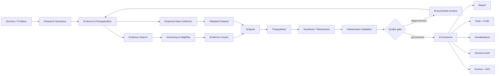
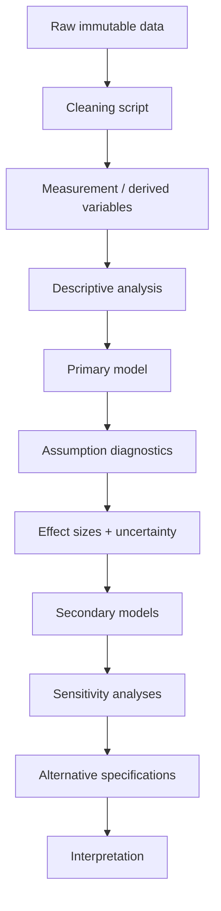
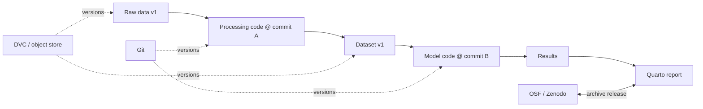
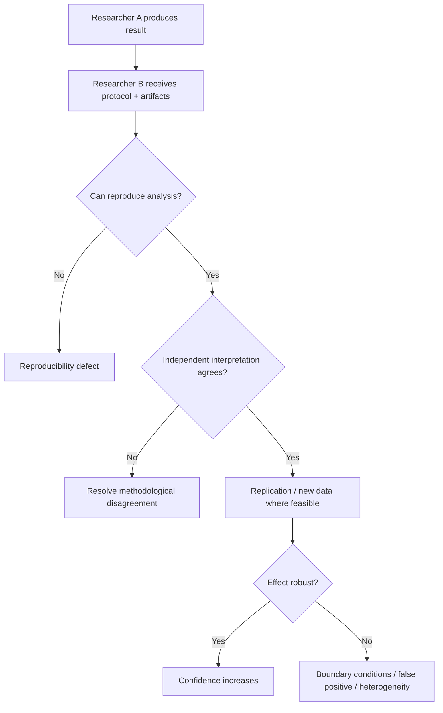
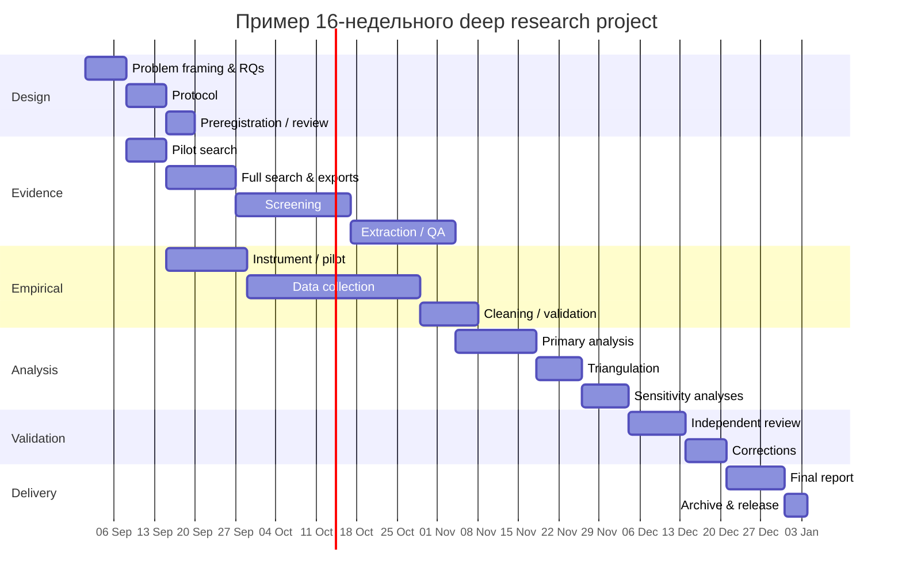
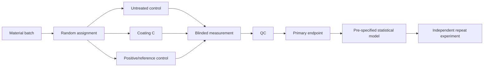

# Глубокое исследование: методология проектирования, проведения и проверки исследования высокого качества

## Executive summary

**Глубокое исследование** — это не просто длительный поиск большого числа источников. В профессиональном смысле это **управляемый, проверяемый и воспроизводимый процесс уменьшения неопределённости относительно заранее определённого вопроса или решения**. Его качество определяется не объёмом найденного материала, а тем, насколько прозрачно связаны: исследовательский вопрос → протокол → поиск и сбор данных → критерии отбора → анализ → проверка альтернативных объяснений → выводы → артефакты, позволяющие другому исследователю понять и, насколько возможно, воспроизвести путь к результату. Эта логика согласуется с PRISMA, Cochrane Handbook, FAIR Principles, практиками preregistration и европейскими принципами research integrity. citeturn18search4turn18search7turn0search0turn19search0turn15search1

Главный практический вывод: **deep research следует проектировать как систему доказательств, а не как процесс написания текста**. Итоговый отчёт является лишь одним из выходных артефактов. Не менее важны protocol, search log, таблица eligibility decisions, data dictionary, raw/processed datasets, analysis code, provenance log, sensitivity analyses и версия окружения. FAIR Principles прямо распространяют идею управляемости и повторного использования не только на данные, но и на алгоритмы, инструменты и workflows. citeturn0search0turn0search2

Для практически значимого исследования оптимальна следующая архитектура:



При этом **воспроизводимость не означает, что любое исследование должно дать идентичный результат при повторении**. NASEM различает computational reproducibility и более широкую replication: первая требует достаточных данных, кода и вычислительных условий для воспроизведения анализа, вторая проверяет устойчивость научного утверждения на новых данных или в новой реализации. citeturn7search4turn7search10

Для систематического поиска нельзя считать Google Scholar, одну библиографическую базу или LLM достаточным источником корпуса. Cochrane рекомендует заранее планировать поиск, использовать несколько релевантных источников, включать controlled vocabulary и свободный текст, документировать точные запросы и при необходимости обращаться к специализированным, региональным и серым источникам; однобазовый поиск увеличивает риск пропусков. citeturn18search0 JBI дополнительно рекомендует итеративную стратегию: сначала exploratory search и выделение терминологии, затем полный поиск с адаптацией синтаксиса по базам, затем citation searching и другие дополнительные каналы. citeturn5search8turn5search12

Для эмпирической части нет универсально лучшей парадигмы. **Quantitative methods** предпочтительны, когда вопрос касается величины эффекта, различий, ассоциаций, прогнозирования или причинных эффектов при подходящем дизайне; **qualitative methods** — когда нужно понять механизм, интерпретацию, опыт, процесс или контекст; **mixed methods** оправданы только тогда, когда интеграция этих типов данных действительно отвечает на вопрос лучше, чем один метод. NIH Best Practices рассматривает интеграцию qualitative и quantitative компонентов как центральную характеристику mixed-methods design, а не просто наличие двух наборов данных. citeturn13search2

Для статистического анализа нельзя сводить доказательство к `p < 0.05`. ASA подчёркивает, что p-value не измеряет вероятность истинности гипотезы и сам по себе не показывает величину или практическую важность эффекта. Поэтому качественный анализ должен показывать effect sizes, uncertainty intervals, assumptions, missing-data handling, model diagnostics и sensitivity/robustness analyses. citeturn7search1turn7search2

Для qualitative research столь же опасен механический подход к «объективности». Например, COREQ полезен как 32-пунктовый reporting checklist для интервью и focus groups, но он не должен автоматически превращаться в универсальную шкалу качества; методология его разработки также подвергалась критической репликационной оценке. citeturn13search1turn13search8 В reflexive thematic analysis, например, механическое требование высокого intercoder agreement может противоречить самой эпистемологии метода; Braun и Clarke подчёркивают необходимость согласования процедуры анализа с выбранной разновидностью thematic analysis. citeturn13search11

**Рекомендуемый организационный принцип:**

> Каждый существенный вывод должен иметь прослеживаемую цепочку  
> **claim → evidence → transformation/analysis → uncertainty → validation → provenance**.

Это существенно более надёжное определение «глубины», чем количество страниц, источников или агентных шагов.

Исходные ограничения по времени и бюджету в запросе не заданы: **no specific constraint**. Поэтому ниже приведены не котировки, а ориентировочные planning ranges, которые следует пересчитать под предметную область, стоимость персонала, доступ к лаборатории, платные базы данных и требования регуляторов.

## Что делает исследование действительно глубоким

Качество проекта полезно оценивать не одной метрикой, а несколькими независимыми измерениями.

| Измерение | Слабое исследование | Исследование высокого качества |
|---|---|---|
| Цель | «Изучить тему X» | Уменьшить конкретную неопределённость или проверить конкретное утверждение |
| Research question | Широкий и изменяется в процессе | Операционализирован до поиска/сбора данных |
| Search | Одна система, первые результаты | Несколько дополняющих источников, documented queries, citation chaining |
| Selection | Интуитивный | Явные inclusion/exclusion criteria и причины исключения |
| Evidence | Все источники равнозначны | Учитываются дизайн, bias, provenance, статус peer review |
| Data | Собираются «все доступные» данные | Собираются данные, необходимые для заранее определённых estimands/questions |
| Analysis | Выбран после просмотра результатов | Core analysis зафиксирован заранее; exploratory analysis помечен отдельно |
| Statistics | p-values и средние | Effect sizes, uncertainty, diagnostics, sensitivity |
| Qualitative | Несистематические цитаты | Явный analytical framework, coding/audit trail, reflexivity |
| Mixed methods | Два независимых анализа | Спроектированная интеграция результатов |
| Reproducibility | Только PDF | Data/code/environment/provenance/version history |
| Validation | Автор проверяет себя | Independent review, replication/holdout/sensitivity где применимо |
| Conclusion | Категорическое утверждение | Утверждение ограничено силой evidence и uncertainty |
| Deliverable | Один длинный отчёт | Report + decision brief + evidence/data/code artifacts |

PRISMA 2020, например, специально разделяет проведение исследования и прозрачное reporting: его 27-пунктовый checklist и flow diagram требуют показать, что было найдено, исключено и включено, а также причины исключений. Это хороший шаблон прозрачности для evidence synthesis, но PRISMA **не является заменой качественного research design**. citeturn18search2turn18search6

### От задачи к исследовательскому вопросу

Хороший проект начинается не с поисковой строки, а с **decision statement**:

> Какое решение станет лучше после получения результата исследования?

После этого полезно сформировать пять слоёв:

| Слой | Пример |
|---|---|
| Decision | Следует ли внедрять метод X? |
| Primary question | Повышает ли X показатель Y относительно Z в условиях C? |
| Secondary questions | Где эффект максимален? Какие adverse effects? Каковы механизмы? |
| Estimand / construct | Что именно будет измеряться и в каких единицах? |
| Acceptance criterion | Какой результат изменит решение? |

Для intervention questions применимы PICO-подобные конструкции; для observational, qualitative и mixed-methods задач структура должна адаптироваться к соответствующей методологии. Cochrane использует PICO для определения scope, eligibility criteria и основных поисковых концептов, одновременно предупреждая, что пытаться включить **каждый** элемент вопроса в поисковую строку часто контрпродуктивно: например, outcomes могут плохо отражаться в title/abstract и индексировании. citeturn18search0

Полезная формула исследовательского вопроса:

\[
RQ = (Population/Unit,\ Context,\ Exposure/Intervention,\ Comparator,\ Outcome/Construct,\ Time)
\]

но не каждый компонент должен присутствовать в каждом дизайне.

Для exploratory исследования вместо falsifiable hypothesis допустимы открытые вопросы, однако всё равно необходимо заранее определить:

- единицу анализа;
- границы предметной области;
- временной горизонт;
- что считается релевантным доказательством;
- что находится вне scope;
- критерий остановки поиска;
- какие решения будут считаться confirmatory, а какие exploratory.

Приложенный пользователем SecureCode AI brief хорошо иллюстрирует **research specification** высокого уровня детализации: он отдельно задаёт контекст, исследовательские гипотезы, сравнительные вопросы, threat model, evaluation protocol и требуемые deliverables. Такой brief является сильным входом в исследование, хотя ещё не заменяет formal protocol, eligibility criteria или preregistration. fileciteturn0file0

### Иерархия доказательств должна быть контекстной

Принцип «peer-reviewed = истина» слишком примитивен. Следует разделять как минимум:

**Первичные эмпирические данные → систематические синтезы → стандарты/официальные документы → качественную техническую документацию → practitioner evidence → secondary commentary.**

Но порядок меняется в зависимости от claim. Например:

- для эффективности медицинского вмешательства первична соответствующая clinical evidence;
- для поведения конкретного API первична актуальная официальная документация;
- для закона — нормативный акт;
- для цены — текущая страница поставщика;
- для субъективного пользовательского опыта качественные интервью могут быть информативнее лабораторного benchmark.

Следовательно, **authority оценивается относительно утверждения**, а не один раз для всего документа.

Практичная внутренняя схема оценки каждого источника:

\[
Q_s = f(\text{relevance},\ \text{design quality},\ \text{directness},\
\text{recency},\ \text{independence},\ \text{transparency})
\]

Не следует превращать эту формулу в псевдоточную числовую оценку без валидации. Полезнее хранить перечисленные измерения отдельно.

## Адаптируемый protocol глубокого исследования

Ниже — универсальный protocol template. Для высокорисковых проектов его следует зафиксировать **до** основного поиска или data collection; для exploratory work допустима контролируемая итерация с журналированием amendments.

### Пошаговый protocol template

| Этап | Что сделать | Обязательный артефакт | Exit criterion |
|---|---|---|---|
| **Problem framing** | Сформулировать decision, stakeholders, scope и exclusions | `research_brief.md` | Ясно, какое решение поддерживает проект |
| **Research questions** | Primary/secondary RQs, hypotheses, constructs, estimands | `questions.yaml` | Каждый вопрос можно связать с данными/источниками |
| **Protocol** | Определить методы до результатов | `protocol_v1.pdf/md` | Analysis и eligibility rules определены |
| **Preregistration** | Зафиксировать confirmatory plan там, где это полезно | OSF/другой registry record | Timestamped frozen version |
| **Search design** | Concept blocks, controlled terms, synonyms, RU/EN terms, databases | `search_strategy.md` | Pilot search возвращает known relevant papers |
| **Corpus retrieval** | Выполнить database, citation и grey-literature search | Raw exports + `search_log.csv` | Заданные источники исчерпаны |
| **Deduplication** | DOI/PMID/title/fuzzy matching + manual review | Deduplicated library | Дубликаты промаркированы, не уничтожена provenance |
| **Screening** | Title/abstract → full text → eligibility | Decision log | Каждая запись имеет status/reason |
| **Data collection** | Extract literature data или собрать empirical dataset | Extraction table/raw data | Все mandatory fields заполнены |
| **Quality assessment** | Risk of bias / measurement / source quality | QA table | Quality recorded independently of result direction |
| **Analysis** | Выполнить prespecified analysis | Scripts/notebooks/results | Analysis runs from clean state |
| **Robustness** | Alternative specifications, missing data, outliers, assumptions | Sensitivity report | Ключевые conclusions stress-tested |
| **Triangulation** | Сопоставить методы/источники и противоречия | Evidence matrix | Dissonant evidence объяснена, а не скрыта |
| **Independent validation** | Второй аналитик/peer reviewer/replication | Review log | Critical issues resolved or documented |
| **Reporting** | Report, executive brief, plots, limitations | Versioned release | Claims traceable to evidence |
| **Archiving** | Data/code/protocol/environment + DOI where possible | Immutable archive | Third party can reconstruct the project |

OSF определяет preregistration как time-stamped, read-only plan, опубликованный до data collection или analysis; после отправки registration содержимое фиксируется, а публичным registrations может назначаться DOI. Это позволяет документально различать заранее сформулированный анализ и последующую exploration. citeturn19search0 Registered Reports идут дальше: в этой модели protocol проходит peer review **до** сбора данных, а решение об in-principle acceptance принимается до того, как известен результат. citeturn7search0

Preregistration не запрещает исследователю обнаруживать неожиданное. Правильная практика:

> **изменить анализ можно; нельзя незаметно переписать историю того, когда это решение было принято.**

### Протокол литературного поиска

Высококачественный search process лучше строить в несколько проходов.

**Exploratory pass.** Найти несколько явно релевантных seed papers, обзоров и официальных терминологических источников. Из них извлечь:

- canonical terminology;
- аббревиатуры;
- синонимы;
- более старые названия;
- controlled vocabulary;
- фамилии ключевых авторов;
- названия benchmark/datasets/instruments;
- ключевые cited papers.

**Concept matrix.**

Пример:

| Concept | English | Russian | Controlled/related |
|---|---|---|---|
| Population | adolescent, teenager | подросток | MeSH/subject heading |
| Intervention | social media restriction | ограничение соцсетей | platform restriction |
| Outcome | anxiety, well-being | тревожность, благополучие | validated scale name |

Внутри concept:

```text
(term_A OR synonym_A1 OR synonym_A2 OR Russian_term_A)
```

между независимыми concept:

```text
(concept_A) AND (concept_B)
```

Дополнительно применяются phrase search, truncation, field restrictions и proximity operators, но их синтаксис необходимо переводить под конкретную database/platform. Cochrane рекомендует сочетать controlled subject headings и free text и использовать OR для вариантов одного concept; сам поиск должен итеративно улучшаться по мере обнаружения терминологии. citeturn18search0 PRISMA-S дополнительно требует фиксировать конкретную database **и платформу**, поскольку один и тот же индекс через разные interfaces может иметь различающийся search syntax и поведение. citeturn5search11turn5search13

**Search validation.** До масштабного запуска сформировать небольшой набор известных релевантных papers. Если финальный запрос не возвращает большую часть этого набора, strategy требует пересмотра.

**Supplementary search.** После database search:

- backward citation search;
- forward citation search;
- related-article search;
- relevant reviews;
- conference proceedings;
- theses/dissertations;
- registries;
- reports и grey literature;
- региональные и предметные базы.

Cochrane рассматривает reference-list searching как обязательную часть intervention reviews и рекомендует grey literature и региональные базы там, где они релевантны. citeturn18search0 JBI также описывает citation searching как существенный компонент comprehensive search. citeturn5search8

**Search log** должен содержать как минимум:

```text
source
platform
date_time
exact_query
filters
result_count
export_format
export_filename
file_hash
researcher
notes
```

Cochrane требует документировать источники, даты, исполнителя и поисковые термины достаточно подробно, чтобы поиск был воспроизводим насколько это возможно. citeturn18search0

**Language bias.** Для темы с российской или региональной компонентой нельзя считать поиск только английской терминологии достаточным. Cochrane прямо предупреждает, что снятие language filter в англоязычной базе не заменяет поиск релевантных non-English databases и journals. citeturn18search0

### Inclusion и exclusion criteria

Критерии фиксируются **до full-text screening** и должны быть операциональными.

| Измерение | Inclusion example | Exclusion example |
|---|---|---|
| Population | 18–65 лет | Только дети |
| Geography | EU/EEA | Не описана страна при критичной географии |
| Design | RCT + prospective cohort | Editorial/opinion |
| Date | 2020–2026 | До 2020 |
| Intervention/exposure | Явно определён X | X упомянут только контекстно |
| Outcome | Validated Y | Только surrogate, если он не допускается |
| Publication status | Peer review + preregistered preprints | Blog |
| Language | RU/EN/DE | Другие, если перевод невозможен и это заранее обосновано |
| Data availability | Достаточно данных для extraction | Только abstract без необходимых результатов |

Особенно важно фиксировать **exclusion reason на full-text stage**, а не просто удалять статью. PRISMA flow diagram специально предназначен для прозрачного учёта identified, screened, excluded и included records. citeturn18search2

Для high-stakes review рекомендуется independent double screening либо как минимум независимая проверка спорных случаев и случайной выборки решений. Для rapid/low-risk research допустим single screening с QA sampling — но снижение строгости должно быть зафиксировано как limitation.

### Data collection design

Выбор метода должен следовать из вопроса:

| Question type | Предпочтительный дизайн |
|---|---|
| «Сколько / насколько?» | Quantitative |
| «Есть ли association/effect?» | Quantitative |
| «Почему это происходит?» | Qualitative или mixed |
| «Как люди интерпретируют X?» | Qualitative |
| «Работает ли механизм и почему?» | Mixed |
| «Как результат меняется в контекстах?» | Multilevel quantitative / comparative qualitative / mixed |
| «Какой процесс приводит к результату?» | Longitudinal/process tracing/qualitative/mixed |

**Quantitative collection** может включать controlled experiments, surveys, structured observations, administrative datasets, sensors или secondary datasets. До сбора нужно определить measurement model, primary outcomes, instrument validity, unit of analysis, sampling strategy, stopping rule и missing-data policy.

**Qualitative collection** может включать semi-structured interviews, focus groups, observation, documents или diaries. Здесь заранее задаются sampling logic, interview guide, data saturation/information-power rationale где он применим, transcription procedure, reflexivity и analytical approach. COREQ предоставляет полезный reporting framework для interview/focus-group research, включая research team/reflexivity, design, data collection и analysis/reporting. citeturn13search1

**Mixed methods** имеют смысл, когда есть явный integration question. Основные практические конструкции:

- **convergent** — qualitative и quantitative компоненты идут параллельно и сопоставляются;
- **explanatory sequential** — quantitative result → qualitative exploration причин;
- **exploratory sequential** — qualitative discovery → построение measurement/instrument → quantitative validation.

Именно интеграция, а не параллельное наличие двух методов, является ключевым methodological requirement mixed-methods research. citeturn13search2

### Analysis protocol

Для quantitative analysis безопасная последовательность:



В зависимости от RQ могут применяться:

- descriptive statistics;
- confidence/credible intervals;
- hypothesis tests;
- linear/generalized regression;
- multilevel/hierarchical models;
- survival models;
- time-series models;
- causal inference methods;
- Bayesian modelling;
- meta-analysis;
- machine learning для predictive questions.

Но «более сложная модель» не означает «более глубокое исследование». Модель должна отвечать estimand и assumptions, а не максимизировать техническую сложность.

При confirmatory analysis заранее задаются primary model, covariates, exclusion rules, transformations, multiple-comparison policy и handling missing data. Необходимо показывать effect size и uncertainty, а не только thresholded significance; ASA отдельно предупреждает против вывода научных заключений исключительно из прохождения `p < α`. citeturn7search1turn7search2

Для qualitative analysis возможны thematic analysis, content analysis, framework analysis, grounded-theory approaches, discourse/conversation analysis и другие методы. Выбранный analytic philosophy должен быть согласован с вопросом. Braun и Clarke подчёркивают, что разные разновидности thematic analysis основываются на разных assumptions, поэтому универсального рецепта кодирования нет. citeturn13search11

Практический coding workflow:

```text
raw material
   ↓
familiarisation
   ↓
initial coding
   ↓
analytic memos
   ↓
candidate categories/themes
   ↓
negative/deviant cases
   ↓
theme/category refinement
   ↓
evidence excerpts
   ↓
interpretation
```

Для codebook/reliability-based designs полезны независимое coding и agreement diagnostics. Для reflexive thematic analysis требование «обязательно получить Cohen's κ > X» не следует применять механически: оно относится к другой концепции coding reliability. citeturn13search11

### Triangulation

Triangulation не должна означать «три источника сказали одно и то же, значит это правда».

Более строгий подход строит **convergence matrix**:

| Claim | Literature | Quant data | Qual data | Alternative explanation | Status |
|---|---|---|---|---|---|
| C1 | Supports | Supports | Mixed | Confounding plausible | Moderate |
| C2 | Mixed | Contradicts | Supports | Measurement issue | Unresolved |
| C3 | Supports | — | Supports | Low | Supported |

Особенно информативно **несогласие** источников. Оно может означать:

- разные populations;
- разные operational definitions;
- временную динамику;
- bias;
- confounding;
- measurement error;
- context dependence;
- реально существующую scientific uncertainty.

Глубокое исследование должно сохранять такие противоречия, а не «усреднять» их до красивого narrative.

## Поисковые базы, инструменты и рабочий стек

Ни одна bibliographic database не покрывает всё. Базы различаются по editorial selection, дисциплинам, document types, citation graph, indexing и региональному coverage. Cochrane прямо рекомендует выбирать базы исходя из topic и использовать несколько источников, особенно для cross-disciplinary и специализированных вопросов. citeturn18search0

### Сравнение поисковых баз и discovery tools

| База / инструмент | Основное покрытие | Сильные стороны | Ограничения | Стоимость / доступ | Поддержка русского/мультиязычности |
|---|---|---|---|---|---|
| **PubMed/MEDLINE** | Biomedical, health, life sciences; >40 млн citations/abstracts | MeSH, качественное biomedical indexing, прозрачный поиск | Не универсальная multidisciplinary DB; обычно не содержит full text | Бесплатно | Международные публикации; indexing ориентирован на biomedical ecosystem и англоязычные metadata citeturn16search0turn16search6 |
| **Scopus** | Multidisciplinary journals, books, proceedings, preprints | Большой curated citation index, author/source analytics, broad global coverage | Subscription; результаты зависят от indexed sources | Institutional subscription / quote; Preview частично бесплатен | Международное, включая non-English publications; global/emerging-market coverage является заявленной сильной стороной citeturn16search3turn16search9 |
| **Web of Science Core Collection** | Sciences, social sciences, arts/humanities; journals/books/conferences | Curated citation graph, большая историческая глубина | Subscription depth влияет на доступное coverage | Institutional subscription / quote | Global multidisciplinary; сильнее как curated citation index, чем как полный региональный corpus citeturn16search1turn16search4 |
| **Google Scholar** | Journals, theses, books, preprints, reports и другой scholarly web content | Очень высокий recall, citation chasing, обнаружение obscure material | Непрозрачная полнота indexing, слабая воспроизводимость массового поиска, нет полноценного официального research API | Бесплатно | Очень широкая multilingual discovery citeturn2search4 |
| **OpenAlex** | Open global scholarly graph | Open metadata, citation graph, API и snapshot; CC0 | Metadata quality неоднородна; не заменяет specialist databases | Основные данные бесплатны; API имеет free/freemium tiers | Multilingual global metadata, качество зависит от источника citeturn16search2turn16search8 |
| **Crossref** | DOI-centric scholarly metadata | Канонические DOI metadata, relations, funding/licenses, API, Retraction Watch enrichment | Не full-text literature database; полнота полей зависит от depositor | Public API и bulk metadata доступны бесплатно | Любые языки в той мере, в какой metadata deposited publishers citeturn17search0turn17search2 |
| **Dimensions** | Publications, datasets; в Analytics также grants/patents/trials/policy | Связь разных типов research objects, analytics | Advanced datasets/features коммерческие | Free для personal non-commercial use; Analytics по quote | Международное multidiscipline coverage citeturn17search10turn17search13 |
| **Lens** | Scholarly works + patents | Особенно полезен для связи science ↔ patents и technology landscaping | Не универсальная замена curated disciplinary databases | Есть бесплатные/academic и профессиональные варианты доступа | Международный corpus; полезен для patent-heavy research citeturn17search14 |
| **eLIBRARY.RU / РИНЦ** | Российская научная литература и citation ecosystem | Критически важен для Russian-language coverage; journals, abstracts/full texts, РИНЦ | Полнотекстовый доступ неоднороден; часть ресурсов зависит от подписки | Metadata/basic access и часть текстов доступны открыто; остальное зависит от подписки | **Очень сильная поддержка русского** citeturn20search0turn20search10 |
| **КиберЛенинка** | Open-access scientific publications, особенно Россия/СНГ | Бесплатный full-text discovery, русский corpus | Не следует считать полноценной заменой citation indexes | Бесплатно | **Очень сильная русскоязычная база**, также присутствуют другие языки citeturn20search1turn20search16 |

Практически это означает:

**Медицина:** PubMed/MEDLINE + Embase/CENTRAL при необходимости + citation search.

**General multidisciplinary:** Scopus или Web of Science + OpenAlex/Crossref + Google Scholar как supplementary discovery.

**Российская проблематика:** обязательно добавлять eLIBRARY/РИНЦ и/или CyberLeninka, а не рассчитывать только на международные индексы. citeturn20search0turn20search1

**Technology/patent research:** Lens + Crossref/OpenAlex + Scopus/WoS.

**Policy/grey literature:** специализированные institutional repositories, government sources, registries и targeted web search в дополнение к bibliographic databases.

Google Scholar особенно полезен как **recall-oriented discovery layer**, но плох как единственный reproducible systematic-search backend из-за непрозрачного coverage. Официальная справка Google перечисляет широкий набор типов scholarly material, но не гарантирует полноту конкретного источника. citeturn2search4

Crossref, напротив, удобен не столько для semantic discovery, сколько для нормализации библиографии, DOI resolution, bibliographic metadata и автоматизированного provenance. Его публичный REST API не требует регистрации, а почти все metadata доступны для повторного использования; abstracts могут сохранять publisher copyright. citeturn17search0turn17search2

### Open-source stack и коммерческие альтернативы

| Research stage | Рекомендуемый open/free stack | Коммерческие / managed alternatives | Практическая рекомендация |
|---|---|---|---|
| Search/discovery | OpenAlex, Crossref, PubMed, Google Scholar, eLIBRARY/CyberLeninka | Scopus, Web of Science, Dimensions Analytics | Не привязывать corpus к одному источнику |
| Reference management | **Zotero** | EndNote, ReadCube Papers | Zotero предпочтителен для переносимости; его source code распространяется под AGPLv3 citeturn8search1 |
| Deduplication/screening | **ASReview**, scripts/R/Python | Covidence, Rayyan paid tiers | Для AI-assisted screening сохранять human audit trail; ASReview — open-source active-learning tool citeturn9search0turn9search3 |
| Surveys | **LimeSurvey Community Edition** | Qualtrics | LimeSurvey можно self-host; Community Edition бесплатна и open source citeturn14search1 |
| Field/offline collection | **KoboCollect/KoboToolbox** | Enterprise survey/field platforms | KoboCollect — free/open-source Android app с offline collection citeturn14search5 |
| Qualitative analysis | **QualCoder**, Taguette | MAXQDA, NVivo, ATLAS.ti | Хороший open stack для coding/transcripts; QualCoder поддерживает text/audio/video/image analysis citeturn11search1turn11search6 |
| Statistical analysis | **R**, Python, JASP, jamovi | Stata, SPSS, SAS | R/Python — лучший выбор для fully scripted reproducibility; GUI tools удобны для обучения |
| Bayesian/statistical GUI | **JASP**, jamovi | Stata/SPSS modules | JASP предоставляет frequentist и Bayesian workflows; jamovi построен поверх R citeturn12search2turn12search1 |
| Notebooks | **Jupyter** | Managed notebook platforms | Jupyter notebooks объединяют code, narrative и output в открытом document format citeturn10search0turn10search1 |
| Reproducible reporting | **Quarto** | Enterprise BI/reporting suites | Один source → HTML/PDF/Word; code/data могут вычисляться вместе с документом citeturn10search12 |
| Code versioning | **Git** | GitHub Enterprise, GitLab Enterprise | Любое изменение analysis должно быть commit-able |
| Data/pipeline versioning | **DVC** | Managed ML/data lineage platforms | DVC хранит version metadata в Git и позволяет version large data/pipelines отдельно citeturn10search4turn10search5 |
| Archiving | Zenodo, OSF | Institutional repositories | Release с immutable identifier/DOI предпочтительнее ссылки на mutable branch; Zenodo интегрируется с repository releases citeturn10search13turn19search0 |
| Visualization | R `ggplot2`, Python/matplotlib, Observable ecosystem | Tableau, Power BI | Publication figures должны генерироваться из analysis data, а не вручную |
| Project management | Git issues, OpenProject и аналогичные OSS | Jira, Asana, Monday | Tasks должны ссылаться на artifacts/decisions, а не существовать отдельно |

**Rayyan и Covidence** удобны для review teams, но это не аргумент отказываться от raw exports и независимого search log. Rayyan имеет free и paid tiers, тогда как Covidence использует коммерческую subscription/per-review модель; конкретные цены лучше проверять перед закупкой, поскольку они меняются. citeturn8search2turn8search8turn8search0

LLM-инструменты стоит помещать **поверх**, а не вместо этой инфраструктуры. Их допустимые роли:

- keyword expansion;
- candidate paper discovery;
- extraction assistance;
- translation;
- summarisation;
- preliminary coding;
- script scaffolding.

Но reference, quotation, numeric extraction и eligibility decision должны быть проверяемы по первичному документу. JBI прямо предупреждает, что bibliographic references, предложенные generative AI, необходимо проверять из-за риска fabricated references. citeturn5search8

## Воспроизводимость, этика и система качества

### Reproducibility by design

Воспроизводимость дешевле строить с начала проекта, чем восстанавливать после окончания.

Рекомендуемая архитектура артефактов:

```text
research-project/
├── README.md
├── protocol/
│   ├── research_questions.md
│   ├── protocol.md
│   └── amendments.md
├── search/
│   ├── strategies/
│   ├── raw_exports/
│   └── search_log.csv
├── screening/
│   ├── eligibility_rules.yaml
│   └── decisions.csv
├── data/
│   ├── raw/          # immutable
│   ├── interim/
│   └── processed/
├── metadata/
│   ├── data_dictionary.yaml
│   └── provenance.jsonl
├── analysis/
│   ├── scripts/
│   ├── notebooks/
│   └── sensitivity/
├── figures/
├── report/
├── environment/
│   ├── lockfile
│   └── container-definition
└── CITATION.cff
```

Принцип:

\[
\text{Raw data} \neq \text{manually edited analysis data}
\]

Raw data должны оставаться immutable; исправления должны реализовываться преобразованием в derived dataset через code или хотя бы записываемый transformation log.

FAIR Principles требуют, среди прочего, persistent identifiers, rich metadata, provenance и ясных условий reuse; FAIR не означает автоматически «всё публично» — чувствительные данные могут быть FAIR при контролируемом доступе. citeturn0search0turn0search2

Для computational work минимальная воспроизводимая единица:

\[
R =
(\text{data version},
\text{code commit},
\text{parameters},
\text{software environment},
\text{random seed},
\text{hardware-relevant assumptions})
\]

Не каждый результат бит-в-бит детерминирован — GPU, parallel computing или stochastic algorithms могут давать различия, — поэтому полезно документировать tolerances и stochastic variation.

### Preregistration, exploratory analysis и amendments

Хороший проект различает:

**Confirmatory:** вопрос/гипотеза/модель определены до просмотра relevant outcomes.

**Exploratory:** анализ возник после наблюдения данных.

Exploratory research не является менее научным; проблема возникает, когда post-hoc decision представляется как a priori.

OSF registrations создают зафиксированный snapshot исследовательского плана и допускают embargo, что позволяет сочетать transparency с временной конфиденциальностью. citeturn19search0turn19search1

Для amendments полезен журнал:

| Date | Original plan | Change | Reason | Data seen? | Impact |
|---|---|---|---|---|---|

### Data/code sharing и versioning

Минимальная схема:



DVC может связывать Git-versioned metadata с данными, которые фактически находятся в внешнем storage, что удобно для больших datasets и reproducible pipelines. citeturn10search4turn10search5 Quarto предназначен для scientific/technical publishing и позволяет строить документы непосредственно из code/data workflow, а Jupyter хранит code, markdown и computational output в открытом notebook format. citeturn10search12turn10search0

### Этика

Перед data collection следует провести **ethics gate**, а не вспоминать об ethics в разделе limitations.

Минимальные вопросы:

| Область | Вопрос |
|---|---|
| Human subjects | Требуется ли ethics/IRB approval? |
| Consent | Как именно получено informed consent? |
| Vulnerable groups | Есть ли повышенный риск coercion/harm? |
| Privacy | Нужны ли прямые identifiers вообще? |
| Re-identification | Можно ли идентифицировать человека после «анонимизации»? |
| Data minimisation | Все ли собираемые поля действительно нужны? |
| Retention | Когда данные удаляются/архивируются? |
| Access | Кто видит raw identifiable data? |
| Secondary use | Разрешено ли новое использование исходным consent/legal basis? |
| AI tools | Может ли sensitive material уйти внешнему provider? |
| Conflicts | Кто финансирует проект и кто заинтересован в результате? |
| Publication | Есть ли риск selective reporting? |

Для медицинских исследований с human participants и identifiable human material/data текущей официальной версией Declaration of Helsinki является редакция 2024 года. citeturn6search1turn6search15 Она относится именно к medical research и не должна механически использоваться как единственный ethics framework для всех дисциплин.

В европейском контексте GDPR Article 89 требует appropriate safeguards для обработки personal data в scientific research, отдельно упоминая data minimisation и pseudonymisation там, где цель может быть достигнута таким способом. citeturn15search0 Это **не означает**, что пометка проекта словом «research» автоматически делает любую обработку персональных данных законной: legal basis, Article 9 special-category rules и национальные нормы необходимо анализировать отдельно.

Research integrity шире privacy. ALLEA European Code of Conduct for Research Integrity, редакция 2023 года, служит междисциплинарной рамкой для европейской research community и используется Еврокомиссией как reference document для EU-funded research. citeturn15search1turn15search3

### Copyright, licenses и text/data mining

Наличие технического доступа к публикации не тождественно наличию права массово скачивать или перераспространять её.

Cochrane прямо рекомендует соблюдать:

- copyright legislation;
- database licence agreements;
- условия скачивания records и publications,

причём конкретные правила различаются между jurisdictions и institutional subscriptions. citeturn18search0

Поэтому automated literature pipeline должен сохранять отдельно:

```text
bibliographic metadata
full-text access status
license
source
permitted processing/reuse
redistribution status
```

Особенно это важно при создании локального full-text corpus для embeddings/LLM/TDM.

### Quality gates

Исследование желательно проверять на нескольких уровнях:

| Gate | Проверяем |
|---|---|
| **Question validity** | Отвечает ли дизайн реальному вопросу? |
| **Search validity** | Можно ли пропустить целый класс evidence? |
| **Eligibility validity** | Последовательно ли применены критерии? |
| **Measurement validity** | Измеряет ли переменная нужный construct? |
| **Internal validity** | Bias/confounding/leakage? |
| **Statistical validity** | Assumptions, uncertainty, power, multiplicity? |
| **Qualitative credibility** | Reflexivity, data adequacy, negative cases, traceability? |
| **External validity** | Насколько generalizable/transferable результат? |
| **Computational reproducibility** | Запускается ли analysis повторно? |
| **Robustness** | Вывод переживает разумные альтернативные assumptions? |
| **Independent review** | Видит ли другой исследователь скрытые ошибки? |
| **Claim calibration** | Не сильнее ли формулировка, чем evidence? |

Для количественного результата полезна **multiverse/sensitivity logic**:

\[
C =
\{M_1,M_2,\ldots,M_k\}
\]

где \(M_i\) — разумные варианты preprocessing, model specification, outlier handling, covariates или missing-data assumptions.

Если claim справедлив только при \(M_3\), а при остальных вариантах исчезает или меняет знак, это важнее одного красивого `p-value`.

Для causal claims sensitivity особенно критична: correlation, prediction и causality нельзя подменять друг другом.

### Peer review и replication

Независимая проверка может происходить до публикации:



Registered Reports являются одним из наиболее сильных механизмов борьбы с result-driven publication decisions, поскольку methods проходят оценку до получения основных результатов. citeturn7search0

Однако peer review сам по себе не «сертифицирует истину». Поэтому для критических результатов остаются важны reproduction, independent re-analysis и replication.

## Планирование, ресурсы, deliverables и управление проектом

**Исходное ограничение:** **no specific constraint**.

Значит, разумнее оценивать проект по уровням assurance, а не предлагать одну фиктивно точную цену.

### Ресурсная модель

| Уровень | Типичная цель | Команда | Продолжительность | Planning budget* |
|---|---|---|---:|---:|
| Exploratory | Landscape / decision support | 1 researcher + occasional expert | 2–6 недель | €2k–€15k |
| Rigorous evidence review | Reproducible review / thesis | Lead + second reviewer + information specialist/analyst | 6–16 недель | €15k–€60k |
| Empirical social science | Survey/interviews/mixed | PI + RA/data analyst + participants/recruitment | 3–9 мес. | €30k–€150k+ |
| High-assurance multidisciplinary | Evidence + empirical + independent validation | PI + specialists + analyst/statistician + reviewer | 6–18 мес. | €75k–€300k+ |
| Laboratory natural science | Experimental validation | PI + researcher/technician + statistician + laboratory | 6–24+ мес. | €50k–€500k+, иногда значительно выше |

\*Это **планировочные порядки величины**, а не текущие рыночные котировки. Они зависят прежде всего от fully loaded personnel cost, recruitment, assays/reagents, instruments, compute, subscriptions и regulatory requirements. Для capital-intensive laboratory research верхняя граница может превышать таблицу на порядки.

Полезнее всего бюджетировать отдельно:

\[
B =
B_\text{people}
+B_\text{data}
+B_\text{participants}
+B_\text{lab}
+B_\text{software}
+B_\text{compute}
+B_\text{publication}
+B_\text{QA}
+B_\text{contingency}
\]

Для knowledge-intensive research **personnel обычно нельзя рассматривать как бесплатный ресурс**: сокращение бюджета часто фактически означает сокращение independent screening, QA, statistical support или reproducibility work.

### Пример timeline

Для универсального 16-недельного evidence-rich research project:



В реальном проекте literature search и empirical collection часто выполняются параллельно только после того, как общий protocol стабилизирован.

### Deliverables

Оптимальный final package:

| Deliverable | Для кого | Формат |
|---|---|---|
| Executive summary | Decision maker | 1–3 страницы PDF/HTML |
| Full analytical report | Research/technical audience | HTML + PDF |
| Research protocol | Reviewer/auditor | Markdown/PDF |
| Search strategies | Reproducibility | TXT/Markdown |
| Search log | Reproducibility | CSV/JSON |
| Source library | Research team | BibTeX/RIS/Zotero |
| Screening decisions | Auditor | CSV |
| Extraction dataset | Analyst | CSV/Parquet |
| Data dictionary | Analyst/reuser | YAML/CSV |
| Raw dataset | Restricted/public archive | Native/standard format |
| Analysis code | Reproduction | Git repository |
| Notebooks | Review | `.ipynb` / Quarto |
| Figures | Publication | SVG/PDF/PNG |
| Sensitivity appendix | Reviewer | HTML/PDF |
| Provenance manifest | Auditor | JSON/JSONL |
| Environment spec | Reproduction | lockfile/container |
| Archived release | Long-term reuse | OSF/Zenodo DOI |

UNESCO's 2021 Recommendation on Open Science, adopted by its member states, treats open scientific knowledge broadly: publications, research data, software/source code and hardware are all parts of the open-science ecosystem. citeturn6search0 Это не отменяет privacy, intellectual-property или security restrictions; открытие должно быть **as open as possible, as restricted as necessary**.

### Project-management checklist

Перед стартом:

- [ ] Decision statement определён.
- [ ] Primary и secondary RQs разделены.
- [ ] Scope и out-of-scope зафиксированы.
- [ ] Stakeholders и decision owner известны.
- [ ] Research design соответствует questions.
- [ ] Ethics/privacy/legal review выполнен.
- [ ] Conflict-of-interest declaration подготовлен.
- [ ] Success/stop criteria определены.
- [ ] Подготовлен protocol.
- [ ] Preregistration выбран или обоснован отказ.

Перед поиском:

- [ ] Составлена concept/synonym matrix.
- [ ] Есть English и relevant non-English terminology.
- [ ] Controlled vocabulary проверена.
- [ ] Выбрано несколько complementary databases.
- [ ] Pilot set известных relevant papers собран.
- [ ] Search strategy проходит recall sanity check.
- [ ] Exact queries и platforms журналируются.
- [ ] Grey literature/citation-search strategy определена.
- [ ] Database licensing/TDM restrictions проверены.

Перед screening:

- [ ] Inclusion/exclusion criteria операциональны.
- [ ] Reviewers прошли calibration sample.
- [ ] Full-text exclusion reasons стандартизированы.
- [ ] Deduplication не уничтожает source provenance.

Перед data collection:

- [ ] Instruments/variables валидированы или limitations документированы.
- [ ] Sampling plan определён.
- [ ] Sample-size/power rationale определено там, где применимо.
- [ ] Consent и ethics approval получены до recruitment, если требуются.
- [ ] Data dictionary создан **до** основного анализа.
- [ ] Raw-data write policy определена.
- [ ] Backup/retention/access policies работают.

Перед analysis:

- [ ] Primary outcomes/model идентифицированы.
- [ ] Confirmatory и exploratory analysis разделены.
- [ ] Missing-data strategy зафиксирована.
- [ ] Outlier policy зафиксирована.
- [ ] Multiple-testing issue рассмотрен.
- [ ] Analysis запускается кодом, а не ручной цепочкой UI.
- [ ] Software/package versions фиксируются.
- [ ] Random seeds фиксируются там, где это имеет смысл.

Перед conclusions:

- [ ] Effect sizes и uncertainty представлены.
- [ ] Statistical assumptions проверены.
- [ ] Alternative specifications проверены.
- [ ] Negative/deviant evidence рассмотрена.
- [ ] Conflicting literature явно показана.
- [ ] Alternative explanations рассмотрены.
- [ ] Causal language соответствует design.
- [ ] Limitations могут изменить практическое решение — не спрятаны в конце.

Перед release:

- [ ] Второй человек может воспроизвести critical analysis.
- [ ] Figures генерируются из data/code.
- [ ] Каждое важное число traceable.
- [ ] Каждая substantive citation проверена по первичному источнику.
- [ ] Код/data имеют version identifier.
- [ ] Confidential data удалены из public artifacts.
- [ ] README содержит reproduction instructions.
- [ ] Release архивирован/заморожен.
- [ ] Report version/date указаны.

## Примеры применения методологии

### Пример из социальных наук

**Задача:** определить, связано ли внедрение четырёхдневной рабочей недели с благополучием сотрудников и изменением производительности, и понять механизмы возможного эффекта.

Плохой вопрос:

> «Полезна ли четырёхдневная рабочая неделя?»

Более строгая постановка:

> «Как изменение с пятидневной на четырёхдневную рабочую неделю при сохранении общей compensation связано с validated well-being scores и объективными productivity indicators в knowledge-work teams через 3 и 6 месяцев, и какие organisational mechanisms сотрудники связывают с изменениями?»

**Design:** mixed-methods explanatory sequential.

**Literature:** Scopus/WoS/OpenAlex + Google Scholar supplementary search; для российской выборки — eLIBRARY/РИНЦ. Используются English/Russian synonyms, backward/forward citations и grey reports.

**Quantitative component:** ideally controlled/quasi-experimental longitudinal design; baseline + follow-ups; заранее определён primary outcome; model учитывает clustering сотрудников внутри команд.

**Qualitative component:** purposive subsample с контрастными outcomes — улучшение, отсутствие изменения, ухудшение. Semi-structured interviews анализируются, например, reflexive thematic analysis или framework analysis в зависимости от epistemological design.

**Integration:** quantitative result не просто помещается рядом с interview quotes. Строится joint display:

| Quant finding | Qual explanation | Interpretation |
|---|---|---|
| Well-being ↑ | меньше commuting/recovery time | plausible mechanism |
| Productivity ≈ | meetings compressed | efficiency adaptation |
| Team X worsened | understaffing / workload compression | context boundary |

NIH guidance по mixed methods подчёркивает именно такую необходимость связывать strands на уровне design, methods и interpretation. citeturn13search2

**Sensitivity:** alternative productivity definitions, attrition, organisation fixed effects, baseline differences, seasonality.

**Ethics:** employee-management power imbalance, confidentiality и риск повторной идентификации в малых teams требуют отдельного контроля. В EU context personal-data processing должно соответствовать GDPR safeguards, включая minimisation и pseudonymisation где применимо. citeturn15search0

**Сильный вывод** мог бы выглядеть так:

> «В исследованной выборке внедрение режима ассоциировалось с улучшением X на Y units [CI], при отсутствии статистически и практически значимого изменения объективного productivity measure Z; interviews указывают на recovery time как возможный механизм, но non-random allocation не позволяет уверенно приписать весь эффект режиму работы».

А не:

> «Наука доказала, что четырёхдневная неделя лучше».

### Пример лабораторного естественно-научного проекта

**Задача:** проверить, снижает ли новый surface coating бактериальную adhesion на медицинском материале.

Research question:

> «Уменьшает ли coating C adhesion бактерии B на материале M через 24 часа относительно untreated control при стандартизированных culture conditions?»

Перед experiment:

- primary endpoint фиксируется;
- strain и biological unit определяются;
- biological и technical replicates не смешиваются;
- sample-size rationale готовится;
- randomization/blinding применяются где технически возможны;
- batch effects планируются заранее;
- exclusion rules для contaminated/failed samples заданы;
- protocol/version реагентов фиксируется.

Пример experiment structure:



Ключевой methodological distinction:

\[
n_{\text{technical replicates}} \neq n_{\text{independent biological units}}
\]

Три measurement wells одного biological specimen не должны автоматически интерпретироваться как три независимых biological observations.

Основной analysis показывает effect size и interval uncertainty, а не только p-value, в соответствии с принципами статистической интерпретации ASA. citeturn7search1

Robustness layer может включать:

- независимую повторную experimental batch;
- альтернативный strain;
- другой operator;
- blinded analysis;
- positive/negative controls;
- проверку assay sensitivity;
- alternative normalization;
- microscopic confirmation вторым методом.

Если первоначальный эффект воспроизводится только в одной batch, честный результат — **batch-sensitive evidence**, а не «coating доказан».

## Типичные ошибки, mitigation и итоговый стандарт качества

### Наиболее опасные failure modes

| Ошибка | Почему опасна | Mitigation |
|---|---|---|
| **Начать с поиска вместо RQ** | Корпус начинает диктовать вопрос | Decision → RQ → protocol → search |
| **Scope creep** | Критерии меняются вслед за находками | Protocol + amendment log |
| **Одна database** | Систематические пропуски | Complementary databases + citation search |
| **Только English search** | Региональный/language bias | Multilingual terms и regional databases |
| **Too many search concepts** | Теряется recall | Искать только concepts, хорошо представленные в metadata; Cochrane отдельно предупреждает против чрезмерного числа blocks citeturn18search0 |
| **Нет exact search log** | Поиск невозможно проверить | Query/platform/date/result-count/export |
| **LLM как источник истины** | Hallucinated citations/extraction | LLM = candidate generator; primary-source verification citeturn5search8 |
| **Screening по intuition** | Selection bias | Predetermined eligibility + exclusion reasons |
| **Quality оценена после результата** | Confirmation bias | QA independent of effect direction |
| **HARKing** | Exploratory finding выглядит confirmatory | Preregistration + explicit exploratory label |
| **p < 0.05 = truth** | Игнорируются magnitude/uncertainty | Effect size + CI/credible interval + sensitivity citeturn7search1 |
| **Много моделей, опубликована одна** | Hidden researcher degrees of freedom | Prespecification/multiverse disclosure |
| **Correlation → causality** | Неверное решение | Design-specific causal language |
| **Qualitative cherry-picking** | Quotes заменяют анализ | Coding trail, negative cases, reflexivity |
| **Kappa для любого qualitative method** | Методологическая несовместимость | Reliability metrics только при соответствующей coding paradigm citeturn13search11 |
| **Triangulation как majority vote** | Скрывает heterogeneity | Анализировать convergence и divergence |
| **Excel вручную как единственная pipeline** | Невоспроизводимые transformations | Scripted processing + immutable raw data |
| **Mutable final dataset** | Нельзя понять, что анализировалось | Version/hash/DOI |
| **Data sharing без privacy check** | Re-identification/legal risk | Minimisation, pseudonymisation, controlled access citeturn15search0 |
| **Peer reviewed = безошибочно** | Peer review не является replication | Re-analysis + robustness + replication |
| **Очень длинный report = deep research** | Объём маскирует слабое evidence | Claim-to-evidence traceability |
| **Все ограничения спрятаны в appendix** | Decision maker получает ложную уверенность | Decision-critical uncertainty в executive summary |

### Универсальный критерий завершения

Глубокое исследование можно считать зрелым не тогда, когда «больше нечего написать», а когда выполнены следующие условия:

\[
\boxed{
\text{Decision relevance}
\land
\text{Evidence coverage}
\land
\text{Methodological validity}
\land
\text{Traceability}
\land
\text{Robustness}
\land
\text{Transparency}
}
\]

То есть:

**Decision relevance:** результат отвечает на исходный decision/RQ.

**Evidence coverage:** поиск охватывает разумно ожидаемые классы evidence, а ограничения coverage известны.

**Methodological validity:** дизайн позволяет делать именно тот тип inference, который делается.

**Traceability:** любое важное утверждение можно проследить до evidence/data и преобразований.

**Robustness:** разумные альтернативные analytical decisions не превращают главный вывод в противоположный без явного предупреждения.

**Transparency:** читатель видит deviations, exclusions, uncertainty и conflicts, а не только итоговую историю.

Для systematic evidence synthesis PRISMA 2020 предоставляет зрелый reporting framework, а Cochrane Handbook — детальную методологию планирования, поиска, selection и synthesis. citeturn18search4turn18search7 Для preregistration полезна OSF infrastructure. citeturn19search0 Для data stewardship — FAIR Principles. citeturn0search0 Для research integrity в европейском контексте — ALLEA Code. citeturn15search1 Для human biomedical research — актуальная Declaration of Helsinki. citeturn6search1

Именно их сочетание ведёт к наиболее практичному определению **«глубокого исследования»**:

> **Это заранее спроектированная, критическая и аудитопригодная процедура построения утверждений из доказательств, в которой поиск стремится минимизировать пропуски, методы соответствуют исследовательским вопросам, альтернативные объяснения активно проверяются, uncertainty не скрывается, а provenance, данные, код и решения сохраняются настолько полно, чтобы независимый исследователь мог проверить не только итог, но и путь к нему.**

Такой подход принципиально отличается и от «обычного поиска информации», и от автоматической генерации большого аналитического текста: глубина возникает из **качества research design, coverage, validation и reproducibility**, а не из числа токенов, страниц, источников или использованных инструментов.
